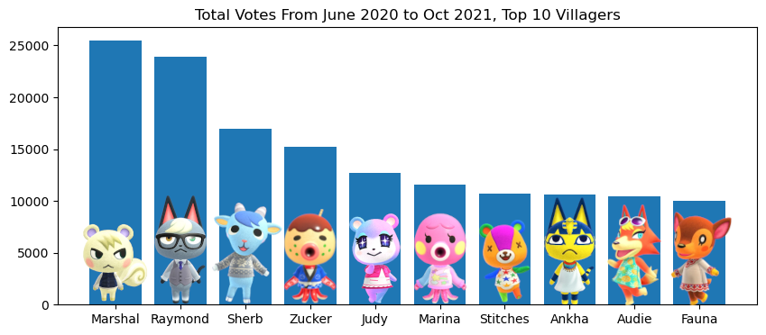
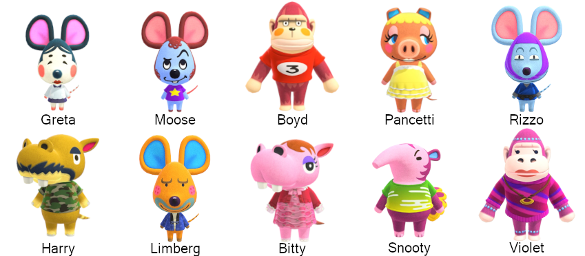
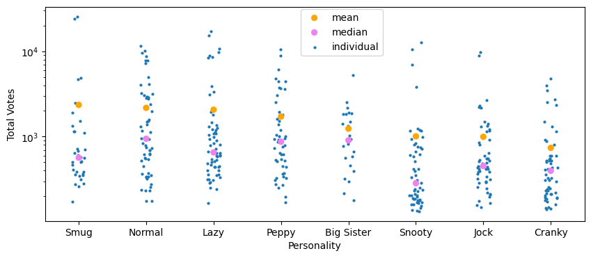
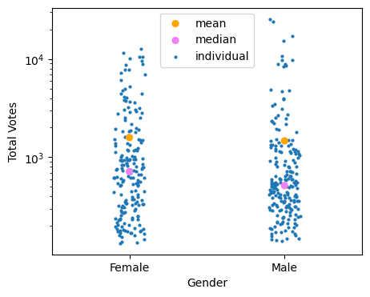
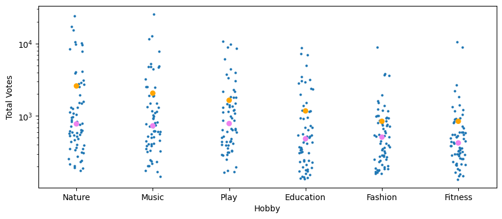
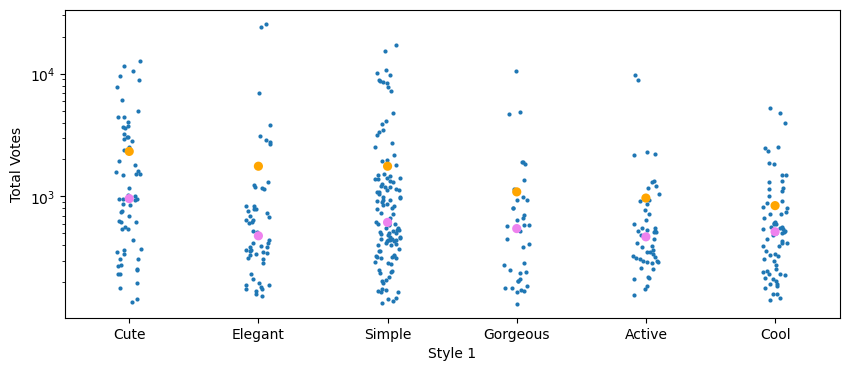
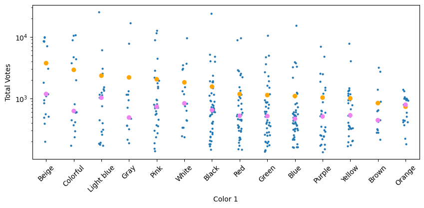
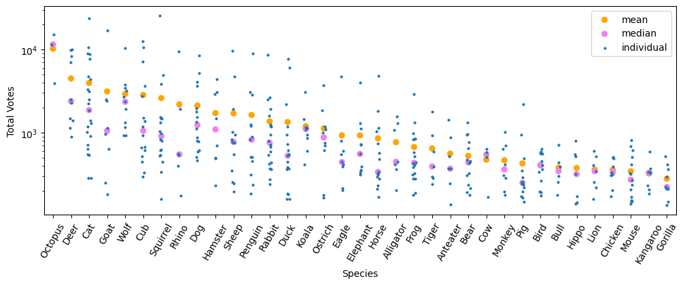
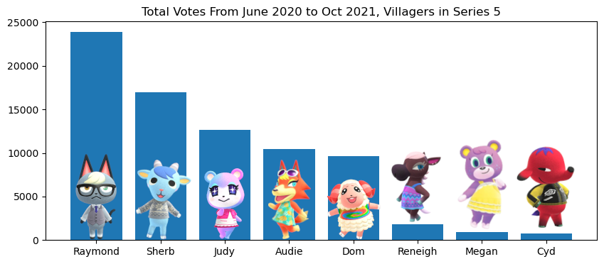

***

## Introduction

**Animal Crossing: New Horizons** is a life simulation game developed and published 
by Nintendo for the Nintendo Switch, and the fifth main entry in the *Animal 
Crossing* series.  The game went viral from its release during the global 
stay-at-home orders during the COVID-19 pandemic.

In the game, players create and control their character who lives on an initially 
remote island with anthropomorphic animal neighbors.  The player has near total 
control over the development of the island into a small community, and with 
enough dedication and luck (really, lots of both), can invite their favorite or 
"dream villagers" to live on their island to complete one part their ideal community.

Fan Community run websites help enthusiastic fans keep a pulse on which collectible 
items, villagers, etc. are in demand for determining trading prices with other players. One such website, [Animal Crossing Portal](https://www.animalcrossingportal.com/) has been 
running a monthly poll where fans can vote for up to 5 villagers (formerly 3 in
the early days).

Raymond the Cat in particular was one villager that attained newsworthy status 
(see, e.g. [Why Raymond is the Most Popular Animal Crossing: New Horizons Villager](https://gamerant.com/animal-crossing-new-horizons-popular-villagers-raymond/)).
He is a new villager to the series and has been in close battles for the top 
popularity spot with Marshal the Squirrel, a newcomer from the previous game and 
was the most popular villager from that era.

Raymond and Marshal notably share three traits provided in the game data: they 
both have the 'Smug' Personality, which determines how they speak for example, 
both are Male gendered, and both prefer to wear 'Elegant'-styled clothing. This 
brings up the question whether a villager's popularity is possibly correlated with 
their in-game provided traits. This is possible to explore with the publicly available 
[poll results](https://www.animalcrossingportal.com/tier-lists/new-horizons/all-villagers/) 
from Animal Crossing Portal.

Another factor I will explore is the whether villager rarity in game (explained 
further later) is also a contributing factor to villager popularity.

*Clarifying points about the data:* 
Data taken from the polls and used for this analysis is taken from June 2020 to 
October 2021.  From June 2020 to January 2021, fans were allowed to pick up to 3 
villagers.  After, they were allowed to pick up to 5 villagers.  
Villager analysis is limited to the **original 391 villagers** included at the time 
of the game's release. I cut off the poll period for the analysis at October 2021 
due to the November 2021 update adding new villagers that some in particular became 
very popular shaking up the usual list of most popular villagers.  There were 
new villagers introduced in March 2021 as part of a collaboration with Sanrio, but
those villagers were not popular enough to break into the topmost spots.

Data about villager traits were taken from this [Kaggle dataset](https://www.kaggle.com/datasets/jessicali9530/animal-crossing-new-horizons-nookplaza-dataset).

## Most and Least Popular Villagers from June 2020 to October 2021

The measure I will use for overall villager popularity is the sum of the poll results 
for each villager from June 2020 to October 2021 (In a possible future analysis, 
mean and median ranking would also be worth looking at).  Below are the top 10 villagers 
that got the most amount of votes in this time period, along with a image of the villager.



*Villager images are from [Animal Crossing Fandom Wiki](https://animalcrossing.fandom.com/wiki/Animal_Crossing_Wiki)*

Below is a table of listed in-game traits of these villagers.

```{python,echo=FALSE,results='hide',message=FALSE}
import pandas as pd
polls = pd.read_csv("villagers_polls.csv",index_col=0)
traits0 = pd.read_csv("villagers_traits.csv",index_col=0)
pollsum=polls.sum(axis='columns')
pollsum.rename("PollSum")
traits=traits0.loc[:,['Species','Personality','Gender','Style 1','Color 1','Hobby']]
polltrait=pd.concat([traits,pollsum],axis=1)
polltrait.rename(columns={0:'PollSum'},inplace=True)
```

```{python,echo=FALSE}
polltrait.sort_values(by="PollSum",ascending=False).head(10)
```

And below are the bottom 10 villagers that got the least amount of votes.  I have 
omitted the bar graph but the range of total votes is from 134 to 154.



```{python,echo=FALSE}
polltrait.sort_values(by="PollSum",ascending=False).tail(10)
```

## Determining if there is a possible relation between Villager In-Game Traits and Popularity

#### Personality

I began with an examination of the mean poll results of villagers categorized by their 
in-game personality.  Sorting by the mean does show a trend of Smug villagers 
being the most popular, but further examination of all villagers in a category shows there 
is a wide spread in popularity with many Smug villagers for example having a low amount of 
total votes, and the median of each personality category does not vary in the same way
as the mean.  After exploring different types of plots, I determined (so far) the most fair 
way to show the data is with a strip plot with means and medians of each category, with a log 
scale on the total votes axis.  This plot is shown below:

 

*Each small blue point represents an individual villager's total poll count over the June 2020 to October 2021 time period.*

The categories are ordered by the highest to lowest mean.  Looking at the Smug category again, we can see the mean is  influenced by the two most popular villagers overall, Raymond and Marshal.  On the other end of popularity sorted by these categories is the Cranky Personality, which clearly has no outlying popular villager (the most popular Cranky villager is Apollo at Rank 27) a noticeable clustering of points at the low end of poll totals.  This makes a compelling argument for a villager having a Cranky Personality being more likely to be less popular.

#### Gender

Although the top 4 most popular villagers are all male, the mean and median total votes split between genders are  higher for female villagers.  



It is worth noting that villager personalities are tied to gender, thus likely influencing the results here.  Normal, Peppy, Snooty, and Big Sister villagers are all female, while Lazy, Jock, Cranky, and Smug villagers are all male.  As shown above, Cranky villagers in particular seem to be more likely to be unpopular.

#### Hobby

I suspect that a villager's appearance besides their personality has a more clear relation with how popular they are, but for now we look at villager's in-game hobby preference.  The categories are again sorted by highest to lowest mean.



Again ignoring Raymond and Marshal (who have the Nature and Music hobbies respectively), it seems like the most popular villagers' more often have Nature has a hobby, but it is not dominant.

#### Clothing Style

Villagers actually have 2 preferred clothing styles in the game, but for simplicity I looked only at the first listed Style, which I assumed is their favorite style overall.



I suspected that Cute would have a high ranking among these categories, and it even beat out Elegant despite Marshal and Raymond both being in that category.  Ironically, I was not expecting Cool would be the lowest ranking in terms of average.

#### Color

Villagers also have 2 favorite colors, and again for simplicity I chose to only to look at the first listed color.



It seems the most popular villagers tend to have pastel colors, consistent with the cute aesthetic (not to be confused with the in-game style) that fans seem to favor.  This pushes the mean for their respective categories higher.  In addition, some categories are sparsely populated, and sorting by the median would produce a different ordering of categories.

#### Species

Finally, we have the Villager's listed Species.



*To clarify, the Cub category means Bear Cub.*

The exceptional category is the Octopus category, which only has 3 villagers, 2 of which are in the top 10 (Zucker and Judy) and the third, Octavian, is ranked 34th.  Deer is another category that appears to lack unpopular villagers.  Going down the list, the categories spread from very popular to least popular, but reaching the least popular end, there becomes a clear absence of exceptionally popular villagers.

#### So are in-game villager traits correlated to the villager's popularity?

It's easy to look at Raymond and Marshal see that they're both Elegantly-dressed and Smug, so that what must be most appealing to the fans.  Even I went into this analysis with the preconceived notion that most Normal villagers tend to be cute, in both their in-game style and their visual design.  But I was overall surprised by the spread of the data from very popular to not popular at all in the categorical breakdowns.

More rigourous statistical tests could be done to determine if there is a correlation, but from this first analysis, I would say there are a few traits that a villager could have that could somewhat accurately predict that they would be more or less popular, and these predictions might be more accurate on the least popular end.  For example, Cranky or Gorilla villagers clearly tend to be less popular.

In my opinion, villager popularity is probably more likely tied to individual visual designs of the villagers, which unfortunately cannot be quantified for an analysis like this.  Another unofficial trait I believe is tied to villager is popularity is perceived rarity, which I also went into a small examination in the next section.

## Villager "Rarity"

While there is an equal chance of finding all villagers in the wild or them visiting the player's island, players can also obtain villagers through physical collectible cards called "Amiibo Cards," which are themselves randomized in a pack.  However, when New Horizons was released, there were 8 villagers new to the series and thus could not be obtained via Amiibo Cards.  The following are the poll results for those villagers:



*(These villagers now have their own Amiibo Cards that released in November 2021)*

So 5 of these 8 villagers are very popular, 4 of them appearing in the top 10 villagers.  Dom is also notably ranked very close to the top 10 at 12th place.  It is likely these villagers popularity is due to combined factors of difficulty to obtain, in addition to appealing individual visual design, and some favorable in-game traits as was discussed earlier.

Also related to rarity is again the Octopus Species category, as there are only 3 villagers out of the original 391, and all three of these villagers are very popular.


## Data Credits and Tools Used

Poll Data was compiled from [Animal Crossing Portal](https://www.animalcrossingportal.com/tier-lists/new-horizons/all-villagers/) and the Villager Traits table was downloaded from [Kaggle](https://www.kaggle.com/datasets/jessicali9530/animal-crossing-new-horizons-nookplaza-dataset).  Villager Images are from [Animal Crossing Fandom Wiki](https://animalcrossing.fandom.com/wiki/Animal_Crossing_Wiki).  Animal Crossing and its villagers are copyright of Nintendo.

Data tools used in this analysis were [pandas](https://pandas.pydata.org/), [matplotlib](https://matplotlib.org/), and [seaborn](https://seaborn.pydata.org/).  The [GIMP](https://www.gimp.org/) image editor was used to put the images of the villagers onto the plots.  This webpage was compiled with [RMarkdown](https://rmarkdown.rstudio.com/) in [Rstudio](https://posit.co/download/rstudio-desktop/). 
